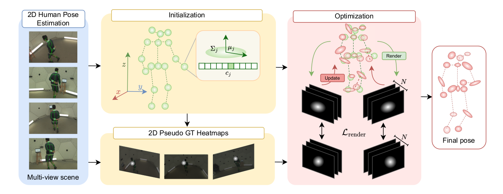

# SkelSplat: Robust Multi-view 3D Human Pose Estimation with Differentiable Gaussian Rendering

We propose SkelSplat, a novel framework for multi-view 3D human pose estimation based on differentiable Gaussian rendering.
Human pose is modeled as a skeleton of 3D Gaussians, one per joint, optimized via differentiable rendering to enable seamless fusion of arbitrary camera views without 3D ground-truth supervision.



## 📦 Installation
```bash

pip install -r requirements.txt

git clone https://github.com/laurabragagnolo/SkelSplat.git --recurse-submodules

pip install submodules/fused-ssim
pip install submodules/simple-knn

pip install submodules/diff-gaussian-rasterization-h36m
pip install submodules/diff-gaussian-rasterization-panoptic
pip install submodules/diff-gaussian-rasterization-op
```


## ⚙️ Data Preparation

SkelSplat has been tested on four datasets: Human3.6M, Human3.6M-Occ, CMU Panoptic and Occlusion-Person.
For data preparation refer to [Data Preprocessing](dataset_tools/README.md) and code provided in `dataset_tools/`.

## 🚀 How to run the code

Run and evaluate SkelSplat on your dataset simply using `train.py` and `eval.py`.
Configuration files for the datasets used in our paper are available in the `configs/` directory (h36m.yaml, panoptic.yaml, etc.).

```bash
python train.py --config-name <dataset>.yaml 

python eval.py --config-name <dataset>.yaml
```